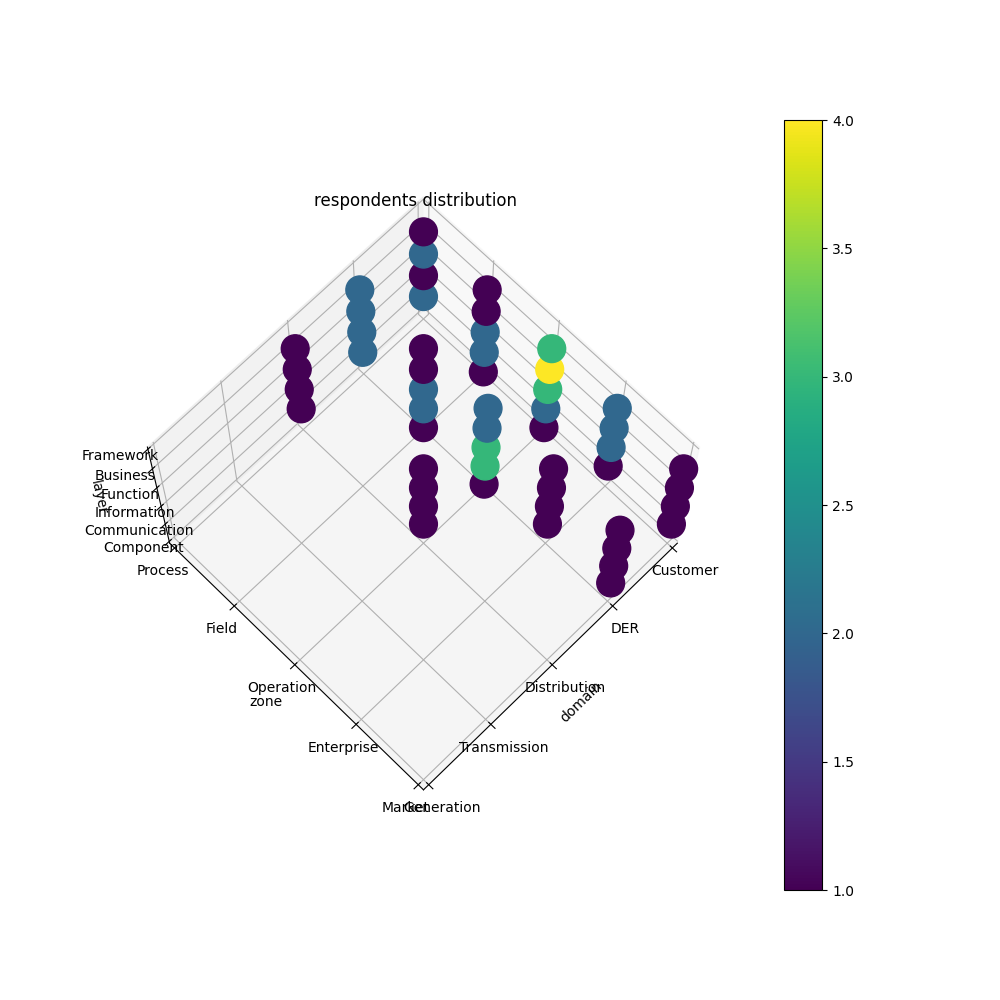
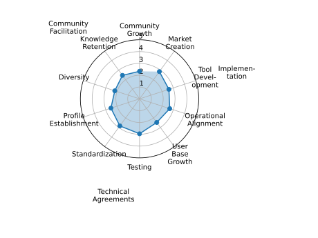
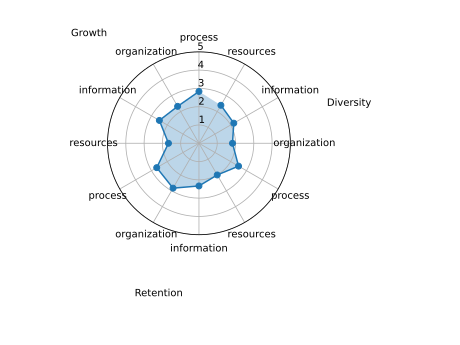
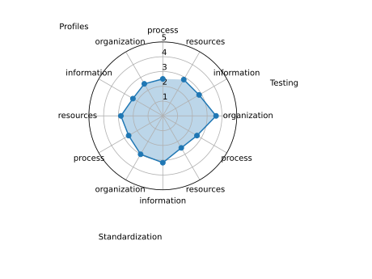

Results of the SIF-2024 maturity assessment
===========================================

Contents
========

* [Introduction](#introduction)
* [Respondent Analysis](#respondent-analysis)
	* [Area of expertise of the respondents](#area-of-expertise-of-the-respondents)
	* [Area of operation of organization](#area-of-operation-of-organization)
* [Maturity Assessment](#maturity-assessment)
	* [Overall Interoperability Maturity Assessment](#overall-interoperability-maturity-assessment)
	* [In depth look at the maturity of the Community Facilitation Capability](#in-depth-look-at-the-maturity-of-the-community-facilitation-capability)
	* [In depth look at the maturity of the Technical Agreements Capability](#in-depth-look-at-the-maturity-of-the-technical-agreements-capability)
	* [In depth look at the maturity of the Implementation Capability](#in-depth-look-at-the-maturity-of-the-implementation-capability)
* [Appendix A: All results](#appendix-a-all-results)
	* [Describing the data in this appendix and guidance on how to interpret it](#describing-the-data-in-this-appendix-and-guidance-on-how-to-interpret-it)
	* [Maturity scores aggregated to the capability level](#maturity-scores-aggregated-to-the-capability-level)
	* [Maturity scores for Community Facilitation, aggregated to the dimension level](#maturity-scores-for-community-facilitation-aggregated-to-the-dimension-level)
	* [Maturity scores for Technical Agreements, aggregated to the dimension level](#maturity-scores-for-technical-agreements-aggregated-to-the-dimension-level)
	* [Maturity scores for Facilitating Implementation, aggregated to the dimension level](#maturity-scores-for-facilitating-implementation-aggregated-to-the-dimension-level)

This report and its' contents were partially generated by the [EMINENT reporting tool](https://www.github.com/int-net/EminentReportingTool). This tool has been developed as part of the int:net project. This work has received funding from the European Union’s Horizon Europe research and innovation programme under grant agreement N°101070086 (int:net).

This report is publisded under the [CC-BY-ND](https://www.creativecommons.org/cc-by-nd) license.
# Introduction

This report contains the result of the EMINENT Interoperability Maturty Assessment that has been performed by members of the sif community. 

The report is built up in the following way:
- Respondent analysis: here the report discusses who has respondet to the questionnaire in terms of: 
    - The area(s) of expertise of the respondents
    - The area(s) of operation of the organizations the respondents represent.
- Maturity Assessment: here the report discusses the maturity scores that follow from the responses that were received. This is done in 4 steps
    - First, the overal maturity scores for the 10 capabilities are discussed
    - Then, for each of the 3 high level capabilities, the report will share the results down to the dimension level.

# Respondent Analysis

This section will give insights into who has responded to the questionnaire. This will be done by looking at the area of expertise of the respondents, as well as the area of operation of the organizations they represent. Both the area of expertise and area of operation are expressed in terms of the the SGAM model
## Area of expertise of the respondents

Respondents were asked to indicate their area of expertise in terms of the SGAM model. The results of the responses has been shown in the diagram below.  

## Area of operation of organization

Respondents were asked to indicate their area of operation of the organization they represent in terms of the SGAM model. The results of the responses has been shown in the diagram below.  

# Maturity Assessment

Respondents were asked to fill out a questionnaire in which each of the questions targeted a different dimension of each of the 10 interoperability capabilities. Respondents were asked to select the characteristic that best fit how they experienced that dimension. The results were aggregated to dimension and capability level. This section contains the aggregated result of that excersize.
## Overall Interoperability Maturity Assessment

This section discusses the overall picture that the maturity assessment has created regarding the interoperabnility maturity of the sif community. The results can be found in the diagram below.  

## In depth look at the maturity of the Community Facilitation Capability

This section discusses in more detail the maturity of the sif community with respect to the Community Facilitation Capability. The results can be found in the diagram below.  

## In depth look at the maturity of the Technical Agreements Capability

This section discusses in more detail the maturity of the sif community with respect to the Technical Agreements Capability. The results can be found in the diagram below.  

## In depth look at the maturity of the Implementation Capability

This section discusses in more detail the maturity of the sif community with respect to the Implementation Capability. The results can be found in the diagram below.  

# Appendix A: All results

This appendix contains all data analysis results from the maturity assessment in tabular from.as such, it goes beyounf the average score that has been used for the spider diagrams inthe main report. We find that the full analysis can give aditional insight into the degreeof consensus about the maturity of the interoperability community as reported by the respondents.Furthremore, this section goes a little deeper into the data quality of the data that was used to create the report.
## Describing the data in this appendix and guidance on how to interpret it

This section describes the data that is presented below, what the different collumns mean, and gives some guidance on how to interpret the data and look for (potentially) relevant patterns.

The data is presented across 4 tables, corresponding to the 4 spider diagrams included in the main report. Each table has 7 collumns:

As a final note, all values have been rounded to 1 digit behind the decimal.
- dimension: The combination of capability and dimension
- maturity_avg: The mean maturity score based on the respnents' answers. Excluding the 'unsure' responses.
- maturity_median: The median maturity score, meaning 50 % of respondents selected an equal or lower score and 50 % selected an equal or higher score. Excluding the 'unsure' responses.
- maturity_mode: The maturity score that was selected the most by the respondents. Excluding the 'unsure' responses.
- number_of_answers: The number of people who responded to this question. If this number does not match the total number of respondents, this not all te data could be interpreted correctly.
- stddev: The standard deviation of the respondens' answers. Excluding the 'unsure' responses.
- number_of_unsure: The number of times respndents selected the 'unsure' option. 

When analysing the data, there are a couple of things a reader can look for to make sense of the data. First and foremost, the reader should keep in mind that EMINENT is a tool for learning, and not for judgement. To this end there is limited value to looking at the average score to see if it is low or high. This only becomes a relevant excersize when one does a maturity tracking excersize and wishes to see if there has been improvement.

During the tests that were executed as part of the int:net project, some best/good practices were developed as to how to go about interpreting the data and developing a narrative that is meaningfule to the interoperability community when it comes to finding area's to prioritize for improvement.

As mentioned before, it isn't particularly valuable to look at the value of particular scores, but it has proven valuable to discuss particulartly high scores (compared to other scores) as well as particularly low scores (again, compared to other scores). Looking for the high scores can help a community identify -or validate- its strengths. First of all, these should be celebrated, but furthermore it can help to discuss what is going well in those area's and why. This can help the commuity formulate success stories as well as serve as inspiration for improvement in other areas. Identifying lower scores can help communities identify area's for growth and improvement. It should be noted though that not every 'lower than average' score should immediately lead to action. Sometimes a low score comes aboutsimply because that area of interoperability is not very relevant (yet). For example, a newly formed community, That is in the process of formulating the first version of the problem statement (profile establishment) or writing their first standards, might not have a high score in testing yet. At this stage putting in a lot of effort to become more mature at testing is simply not fruitful: you need to have a standard, and reference implementations before there is anything to test in the first place. In this phase, it is probably better to put effort in becomingmore mature in those areas of interoperability that the community is corrently working on but strugling with. So when looking for area's of improvement, lower scores can be an indicator, but finding the area's of improvement that need to be prioritized can only happen in discussion with the community.

While the maturity_avg score is used within the report for the spider diagrams, it was found that, in adition the maturity_mode (the most frequently selected answer), as well as the number_of_unsure and the stddev valuesgive important extra context.

A high stddev score indicates that there is disagreemnt among the respondents as to the performance of the interoperability community in that particular capability/dimension combination. What is a high score? Well, given that the possible range of values is between 0 and 5, a stddev of 2.5 would mean half the respondents thinks the maturity is 0 and the other half thinks it is 5. So as a rule of thumb, a stddev <1 suggests a high degree of consensus. A stddev between 1 and 1.5 indicates some disagreement and a stddev >1.5 suggests a high degree of disagreement amongst respondents. In these situations it might be beneficial to organize a conversation with the respondents to identify the origin of the disagreement. While respondents are encouraged to select 'unsure'  if they do not know  the answer, it is still possible that some respondents are close to that subject and select a different answer than those who are more distant from it. 

When the stddev is high, it can be worht while to take the maturity_mode score into consideration as another proxy for the actual score, since it is the answer that is most frequently selected.

Finally, the number_of_unsure values can give some insight into the degree to which members of the community are aware of the efforts that the community makes within certain capabilities/dimensions. It is important to remember that respondents are encouraged to select 'unsure' if they do not know the answer. This way, we can be more confident that those who did select an answer, know what they are talking about and can speak from experience.In large communitities where different members specialize and focus their efforts on different aspects of interoperability, it can be expected that not everyone is aware of everything that is happening. For instance, it is very plausible - and potentially unproblematic- that a testing expert answers 'unsure' to some or all of the questions about 'Userbase Growth'. In a smaller community, however, one would expect to see very few 'unsure' responses. In general, when respondents have selected 'unsure' frequently, it is worthwhile for the community leadership to explore improvements for the communication and knowledge exchange within the community.
## Maturity scores aggregated to the capability level
| capability                                             |   maturity_avg |   maturity_median |   maturity_mode |   number_of_answers |   stddev |   number_of_unsure |
|:-------------------------------------------------------|---------------:|------------------:|----------------:|--------------------:|---------:|-------------------:|
| Community Growth                                       |            2.3 |                 2 |               3 |                  28 |      0.9 |                  4 |
| Knowledge Retention                                    |            2.5 |                 3 |               3 |                  28 |      1.3 |                  4 |
| Diversity of Perspectives                              |            2.2 |                 3 |               3 |                  28 |      1.1 |                  8 |
| Integration Profile Establishment                      |            2.5 |                 3 |               3 |                  28 |      1.2 |                  4 |
| Standardization                                        |            2.8 |                 3 |               3 |                  28 |      0.9 |                  4 |
| Compliance Testing                                     |            3   |                 3 |               3 |                  28 |      1   |                  5 |
| User Base Growth                                       |            2.5 |                 3 |               3 |                  23 |      0.8 |                  6 |
| Operational Alignment                                  |            2.7 |                 3 |               3 |                  28 |      0.9 |                  6 |
| Tool, Product and Reference Implementation Development |            2.6 |                 3 |               2 |                  28 |      1   |                  5 |
| Market Creation                                        |            2.8 |                 3 |               3 |                  28 |      1.2 |                  8 |
## Maturity scores for Community Facilitation, aggregated to the dimension level
| dimension                                         |   maturity_avg |   maturity_median |   maturity_mode |   number_of_answers |   stddev |   number_of_unsure |
|:--------------------------------------------------|---------------:|------------------:|----------------:|--------------------:|---------:|-------------------:|
| Community Growth process                          |            2.8 |               3   |               3 |                   7 |      0.7 |                  1 |
| Community Growth people and organization          |            2.3 |               2.5 |               3 |                   7 |      0.7 |                  1 |
| Community Growth Information                      |            2.5 |               3   |               3 |                   7 |      1.3 |                  1 |
| Community Growth resources                        |            1.7 |               2   |               2 |                   7 |      0.5 |                  1 |
| Knowledge Retention process                       |            2.7 |               2.5 |               2 |                   7 |      1.2 |                  1 |
| Knowledge Retention people and organization       |            2.8 |               3   |               3 |                   7 |      1.2 |                  1 |
| Knowledge Retention Information                   |            2.3 |               3   |               3 |                   7 |      1.4 |                  1 |
| Knowledge Retention resources                     |            2   |               2   |               3 |                   7 |      1   |                  1 |
| Diversity of Perspectives process                 |            2.5 |               3   |               3 |                   7 |      0.9 |                  3 |
| Diversity of Perspectives people and organization |            1.8 |               2   |               3 |                   7 |      1.2 |                  1 |
| Diversity of Perspectives Information             |            2.2 |               3   |               3 |                   7 |      1   |                  2 |
| Diversity of Perspectives resources               |            2.4 |               3   |               3 |                   7 |      1.2 |                  2 |
## Maturity scores for Technical Agreements, aggregated to the dimension level
| dimension                                                 |   maturity_avg |   maturity_median |   maturity_mode |   number_of_answers |   stddev |   number_of_unsure |
|:----------------------------------------------------------|---------------:|------------------:|----------------:|--------------------:|---------:|-------------------:|
| Integration Profile Establishment process                 |            2.5 |               3   |               3 |                   7 |      1.1 |                  1 |
| Integration Profile Establishment people and organization |            2.5 |               2   |               2 |                   7 |      1.3 |                  1 |
| Integration Profile Establishment Information             |            2.3 |               2.5 |               1 |                   7 |      1.1 |                  1 |
| Integration Profile Establishment resources               |            2.8 |               3   |               3 |                   7 |      1.2 |                  1 |
| Standardization process                                   |            2.7 |               2.5 |               4 |                   7 |      1.1 |                  1 |
| Standardization people and organization                   |            3   |               3   |               4 |                   7 |      0.8 |                  1 |
| Standardization Information                               |            3.2 |               3   |               3 |                   7 |      0.7 |                  1 |
| Standardization resources                                 |            2.5 |               2.5 |               2 |                   7 |      1   |                  1 |
| Compliance Testing process                                |            2.7 |               2.5 |               2 |                   7 |      1.1 |                  1 |
| Compliance Testing people and organization                |            3.6 |               3   |               3 |                   7 |      0.8 |                  2 |
| Compliance Testing Information                            |            2.8 |               2.5 |               2 |                   7 |      0.9 |                  1 |
| Compliance Testing resources                              |            2.8 |               3   |               3 |                   7 |      0.9 |                  1 |
## Maturity scores for Facilitating Implementation, aggregated to the dimension level
| dimension                                                                      |   maturity_avg |   maturity_median |   maturity_mode |   number_of_answers | stddev             |   number_of_unsure |
|:-------------------------------------------------------------------------------|---------------:|------------------:|----------------:|--------------------:|:-------------------|-------------------:|
| User Base Growth process                                                       |            3   |               3   |               3 |                   2 | Not Enough Data    |                  1 |
| User Base Growth people and organization                                       |            3   |               3   |               3 |                   7 | 0.5773502691896257 |                  1 |
| User Base Growth Information                                                   |            2.2 |               2   |               2 |                   7 | 0.7483314773547883 |                  2 |
| User Base Growth resources                                                     |            2   |               2   |               1 |                   7 | 0.8944271909999159 |                  2 |
| Operational Alignment process                                                  |            2.3 |               2.5 |               3 |                   7 | 0.7453559924999299 |                  1 |
| Operational Alignment people and organization                                  |            2.3 |               2.5 |               3 |                   7 | 0.7453559924999299 |                  1 |
| Operational Alignment Information                                              |            3.4 |               4   |               4 |                   7 | 0.8                |                  2 |
| Operational Alignment resources                                                |            2.8 |               3   |               3 |                   7 | 0.7483314773547883 |                  2 |
| Tool, Product and Reference Implementation Development process                 |            3.2 |               3   |               2 |                   7 | 1.0671873729054748 |                  1 |
| Tool, Product and Reference Implementation Development people and organization |            2.3 |               2   |               2 |                   7 | 0.4714045207910317 |                  1 |
| Tool, Product and Reference Implementation Development Information             |            2.2 |               2.5 |               3 |                   7 | 1.0671873729054748 |                  1 |
| Tool, Product and Reference Implementation Development resources               |            2.8 |               3   |               2 |                   7 | 0.7483314773547883 |                  2 |
| Market Creation process                                                        |            2.4 |               3   |               3 |                   7 | 0.8                |                  2 |
| Market Creation people and organization                                        |            3.4 |               3   |               3 |                   7 | 1.019803902718557  |                  2 |
| Market Creation Information                                                    |            3   |               3   |               4 |                   7 | 1.4142135623730951 |                  2 |
| Market Creation resources                                                      |            2.6 |               2   |               4 |                   7 | 1.2                |                  2 |